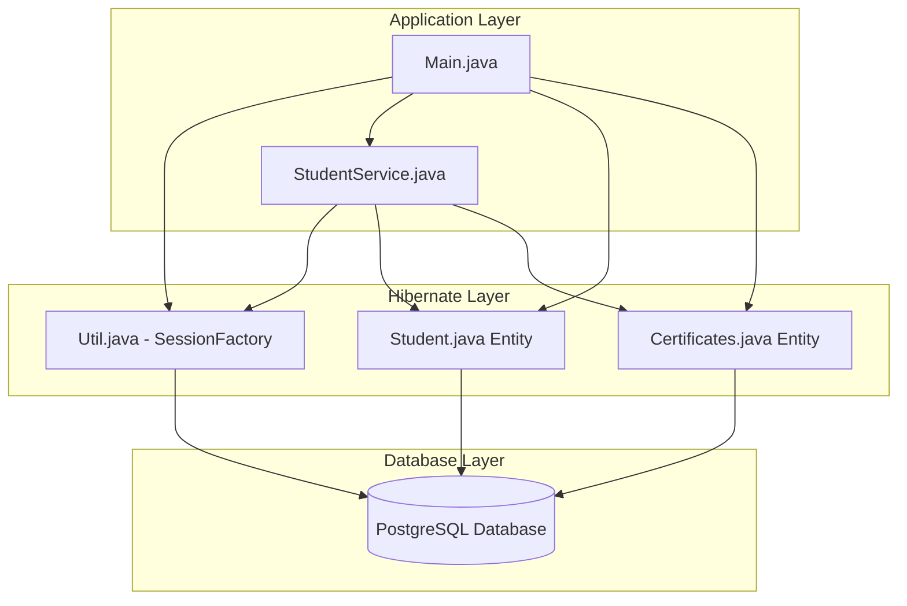

# Project Flow Diagram

## Overview
This document provides a visual and textual representation of the project's architecture and flow, explaining how different components interact with each other.

## Flow Diagram



## File Creation Timeline and Purpose

### 1. pom.xml
**Created:** Initial project setup
**Purpose:** 
- Defines project metadata (groupId, artifactId, version)
- Manages dependencies (Hibernate, PostgreSQL driver, JUnit)
- Sets Java version (21) and other build properties

### 2. hibernate.cfg.xml
**Created:** After setting up project dependencies
**Purpose:**
- Configures database connection settings
- Defines Hibernate-specific properties (dialect, show_sql, format_sql, hbm2ddl.auto)
- Maps entity classes to database tables

### 3. Student.java
**Created:** After hibernate.cfg.xml
**Purpose:**
- Represents a student entity in the application
- Maps to the 'stud' table in the database
- Defines fields, relationships, and methods for student data
- Establishes one-to-many relationship with Certificates

### 4. Certificates.java
**Created:** After Student.java
**Purpose:**
- Represents a certificate entity in the application
- Maps to the 'st_certificates' table in the database
- Defines fields and methods for certificate data
- Establishes many-to-one relationship with Student

### 5. Util.java
**Created:** After entity classes
**Purpose:**
- Manages the Hibernate SessionFactory using Singleton pattern
- Provides a single point of access to the SessionFactory
- Handles SessionFactory initialization and configuration

### 6. StudentService.java
**Created:** After Util.java
**Purpose:**
- Provides a service layer for Student entity operations
- Encapsulates data access logic
- Handles session and transaction management
- Implements CRUD operations for Student entities

### 7. Main.java
**Created:** Last, to demonstrate all components
**Purpose:**
- Entry point of the application
- Demonstrates Hibernate operations with entities
- Shows both direct session usage and service layer usage
- Tests entity relationships and transactions

## Code and Function Explanations

### pom.xml
```xml
<!-- Dependencies required for the project -->
<dependencies>
    <!-- Hibernate Core for ORM functionality -->
    <dependency>
        <groupId>org.hibernate.orm</groupId>
        <artifactId>hibernate-core</artifactId>
        <version>7.1.0.Final</version>
    </dependency>
    
    <!-- JUnit for testing -->
    <dependency>
        <groupId>junit</groupId>
        <artifactId>junit</artifactId>
        <version>4.13.2</version>
        <scope>test</scope>
    </dependency>
    
    <!-- PostgreSQL JDBC Driver for database connectivity -->
    <dependency>
        <groupId>org.postgresql</groupId>
        <artifactId>postgresql</artifactId>
        <version>42.7.7</version>
    </dependency>
</dependencies>
```

### hibernate.cfg.xml
```xml
<!-- Database connection settings -->
<property name="hibernate.connection.url">jdbc:postgresql://localhost:5432/myappdb</property>
<property name="hibernate.connection.username">recoil</property>
<property name="hibernate.connection.password">Om0099889900</property>
<property name="hibernate.connection.driver_class">org.postgresql.Driver</property>

<!-- Hibernate-specific configuration properties -->
<property name="hibernate.dialect">org.hibernate.dialect.PostgreSQLDialect</property>
<property name="hibernate.show_sql">true</property>
<property name="hibernate.format_sql">true</property>
<property name="hibernate.hbm2ddl.auto">update</property>

<!-- Mapping declarations -->
<mapping class="entities.Student"/>
<mapping class="entities.Certificates"/>
```

### Student.java (Key Parts)
```java
@Entity
@Table(name = "stud")
public class Student {
    @Id
    @GeneratedValue(strategy = GenerationType.IDENTITY)
    private long studentId;
    
    private String name;
    private String college;
    private String phone;
    private boolean isActive = true;
    
    @OneToMany(mappedBy = "student", fetch = FetchType.LAZY, cascade = CascadeType.ALL, orphanRemoval = true)
    private List<Certificates> certificates = new ArrayList<>();
    
    // Getters and setters...
}
```

### Certificates.java (Key Parts)
```java
@Entity
@Table(name = "st_certificates")
public class Certificates {
    @Id
    @GeneratedValue(strategy = GenerationType.IDENTITY)
    private long certificate;
    
    private String id;
    private String link;
    
    @ManyToOne
    @JoinColumn(name = "studenId")
    private Student student;
    
    // Getters and setters...
}
```

### Util.java (Key Parts)
```java
public class Util {
    private static SessionFactory sessionFactory;
    
    static {
        try {
            if (sessionFactory == null) {
                sessionFactory = new Configuration()
                    .configure("hibernate.cfg.xml")
                    .buildSessionFactory();
            }
        } catch (Exception e) {
            System.err.println("Error building SessionFactory: " + e.getMessage());
            e.printStackTrace();
            throw new RuntimeException("Error building SessionFactory: " + e.getMessage(), e);
        }
    }
    
    public static SessionFactory getSessionFactory() {
        return sessionFactory;
    }
}
```

### StudentService.java (Key Parts)
```java
public class StudentService {
    private SessionFactory sessionFactory = Util.getSessionFactory();
    
    public void saveStudent(Student student) {
        try (Session session = sessionFactory.openSession()) {
            Transaction transaction = session.beginTransaction();
            try {
                session.persist(student);
                transaction.commit();
            } catch (Exception e) {
                if (transaction != null) {
                    transaction.rollback();
                }
                throw e;
            }
        }
    }
    
    public List<Student> getAllStudent(){
        try(Session session=sessionFactory.openSession()){
            String getHQL="FROM Student";
            Query<Student> query=session.createQuery(getHQL,Student.class);
            return query.list();
        }
    }
    
    // Other methods...
}
```

### Main.java (Key Parts)
```java
public class Main {
    public static void main(String[] args) {
        // Get SessionFactory
        SessionFactory sessionFactory = Util.getSessionFactory();
        
        // Create StudentService
        StudentService studentService = new StudentService();
        
        // Open session and begin transaction
        Session session = sessionFactory.openSession();
        Transaction transaction = session.beginTransaction();
        
        try {
            // Create and save entities
            Student newStudent = new Student();
            newStudent.setName("Alice Johnson");
            newStudent.setCollege("XYZ University");
            newStudent.setPhone("123-456-7890");
            
            // Create certificates
            Certificates cert1 = new Certificates();
            cert1.setId("CERT001");
            cert1.setLink("http://example.com/cert1");
            cert1.setStudent(newStudent);
            
            // Add certificates to student
            List<Certificates> certificates = new ArrayList<>();
            certificates.add(cert1);
            newStudent.setCertificates(certificates);
            
            // Save student (cascade will save certificates)
            session.persist(newStudent);
            
            // Commit transaction
            transaction.commit();
        } catch (Exception e) {
            if (transaction != null) {
                transaction.rollback();
            }
            e.printStackTrace();
        } finally {
            session.close();
        }
        
        // Demonstrate service usage
        Student fetchedStudent = studentService.getStudentById(1L);
        // ... more operations
    }
}
```

## Complete Notes

### Project Architecture
1. **Maven Build System:** Manages dependencies and project structure
2. **Hibernate ORM:** Handles object-relational mapping between Java entities and database tables
3. **PostgreSQL Database:** Stores application data in tables
4. **Entity Classes:** Represent database tables as Java objects
5. **Service Layer:** Encapsulates business logic and data access operations
6. **Utility Class:** Manages expensive resources like SessionFactory
7. **Main Application:** Demonstrates usage of all components

### Key Concepts Demonstrated
1. **Entity Mapping:** Using JPA annotations to map Java classes to database tables
2. **Relationships:** One-to-many and many-to-one relationships between entities
3. **SessionFactory Management:** Using Singleton pattern for efficient resource management
4. **Session Handling:** Opening and closing sessions for database operations
5. **Transaction Management:** Using transactions to ensure data consistency
6. **CRUD Operations:** Creating, reading, updating, and deleting entities
7. **HQL Queries:** Using Hibernate Query Language for database-independent queries
8. **Exception Handling:** Properly handling exceptions during database operations
9. **Resource Management:** Ensuring proper cleanup of resources

### Common Points of Confusion Clarified
1. **HQL vs SQL:** 
   - HQL uses entity names, not table names
   - "FROM Student" refers to the Student entity class
   - Hibernate translates HQL to SQL using mapping information

2. **Parameterized Queries:**
   - Named parameters (e.g., :studentname) are placeholders
   - query.setParameter() safely binds values to prevent SQL injection
   - Much safer than string concatenation

3. **Query Result Methods:**
   - uniqueResult(): Returns single result or null
   - list(): Returns List of results (empty if none found)
   - getSingleResult(): Returns result or throws exception if not found

4. **Entity-to-Table Mapping:**
   - One entity class maps to exactly one database table
   - @Table annotation specifies the actual table name
   - Multiple tables would require separate entities or native queries

### Data Flow
1. Application starts in Main.java
2. Util.java creates/gets SessionFactory
3. Main.java or StudentService.java opens Session
4. Entities are created/modified in Java
5. Session operations persist/merge entities to database
6. Transactions ensure consistency
7. Sessions are properly closed to release resources

### Best Practices Demonstrated
1. **Singleton Pattern:** For SessionFactory management
2. **Try-with-Resources:** For automatic session closing
3. **Transaction Management:** For data consistency
4. **Exception Handling:** For robust error management
5. **Parameterized Queries:** For security against SQL injection
6. **Service Layer:** For separation of concerns