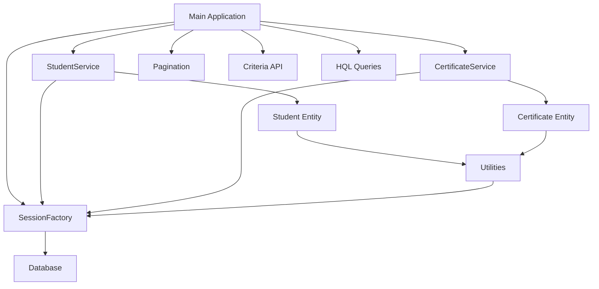

```mermaid
graph TD
    A[Main Application] --> B[StudentService]
    A --> C[CertificateService]
    A --> D[SessionFactory]
    B --> D
    C --> D
    D --> E[Database]
    B --> F[Student Entity]
    C --> G[Certificate Entity]
    F --> H[Utilities]
    G --> H
    H --> D
    A --> I[Pagination]
    A --> J[Criteria API]
    A --> K[HQL Queries]
```